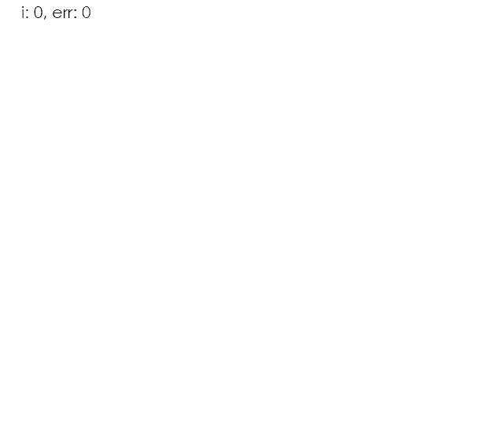

# Unraveler

<figure>
  
  <figcaption>4096 nodes, 8 threads, \theta=0.95
   (Intel Core i7 7700K @ 5.0 GHz)</figcaption>
</figure>

## Introduction
This project demonstrates a basic [force-directed graph drawing](https://en.wikipedia.org/wiki/Force-directed_graph_drawing) technique used on graphs generated using a [preferential attachment](https://en.wikipedia.org/wiki/Preferential_attachment) process. A [Barnes-Hut quadtree](https://en.wikipedia.org/wiki/Barnes%E2%80%93Hut_simulation#The_Barnes%E2%80%93Hut_tree) is used to reduce the complexity of every step from O(n^2) to O(n*log(n)) and multithreading speeds everything up.

A basic UI allows the user to define
- `n` the number of nodes
- `ka`, `kr`, and `kn` attraction, repulsion, and general constants
- `maxIters` and `minError` halting conditions
- `updateEvery` to control how often the UI updates
- `theta` in the range [0, 1) indicates the tradeoff between accuracy (0) and speed (1)
- `numThreads` the number of threads

This is nowhere near as good as state-of-the-art, but it is still fun to see how changing the number of nodes, threads, and value of theta affects performance.
## Run
### server
```
$ cd server
$ go run main.go
```

### ui
install dependencies
```
$ cd ui
$ npm install
```
launch ui
```
$ npm run start
```